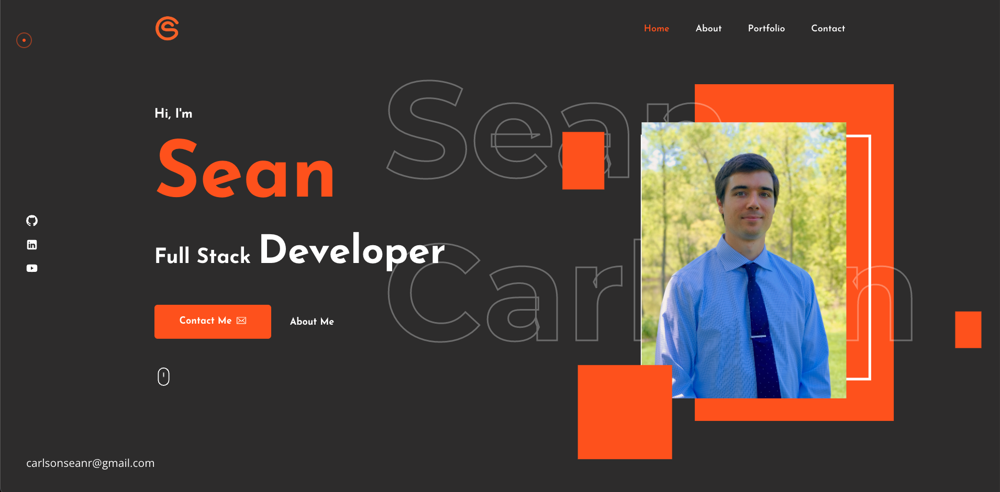
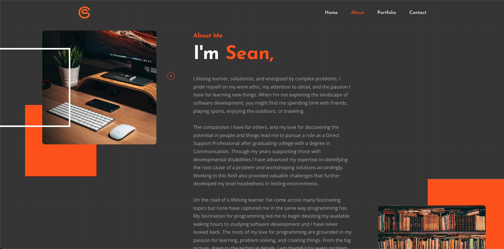
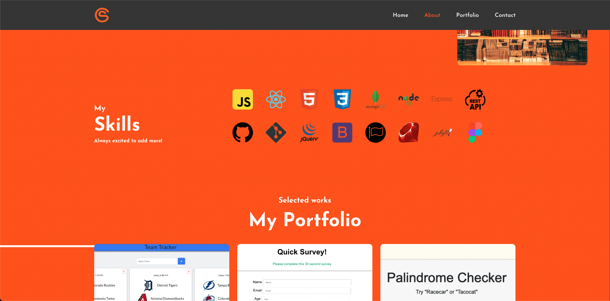
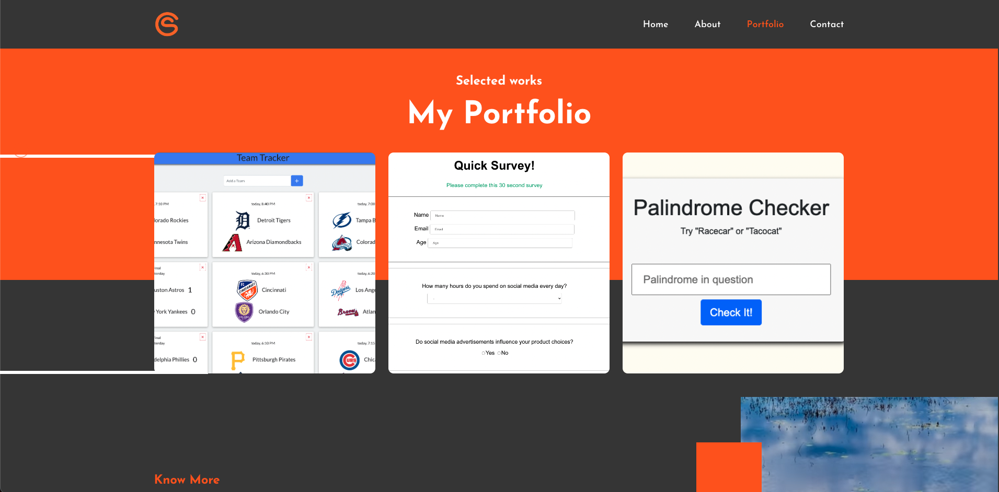
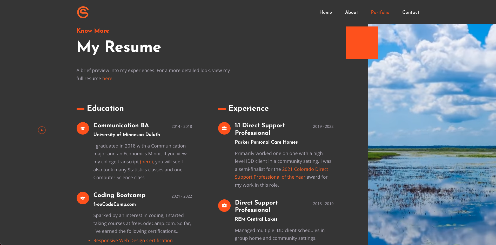
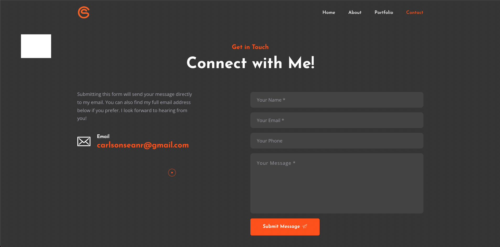
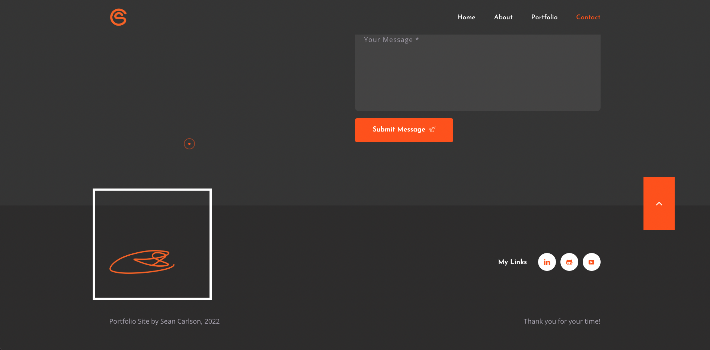

  <h1 align="center">Personal Portfolio</h1>

  

    A personal portfolio site to showcase my work.
     
    <a href="https://seancarlson96.github.io/Palindrome-Checker/" target="_blank"><strong>Live Site »</strong></a> 
     
     
  

  

## About The Project

Site Features:
* Indroduction, About, Skills, Portfolio, Resume, and Contact sections
* Modal descriptions boxes for each selected project in the portfolio
* Magic Cursor and reactive animations
* Links to my Github, LinkedIn, YouTube, and Resume
* PHP Contact Form

## Built With

* Javascript
* HTML
* CSS
* Jekyll
* Ruby
* PHP

## Screenshots

  
  
  
  
  
  
  

<!-- CONTACT -->
## Contact

Sean Carlson - carlsonseanr@gmail.com - <a href="https://www.linkedin.com/in/sean-carlson-5954b5161" target="_blank">LinkedIn</a>

(<a href="#top">back to top</a>)

